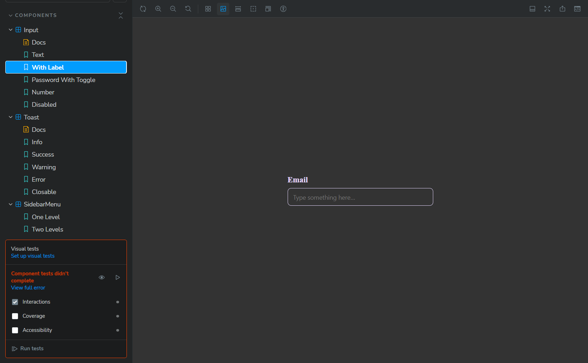
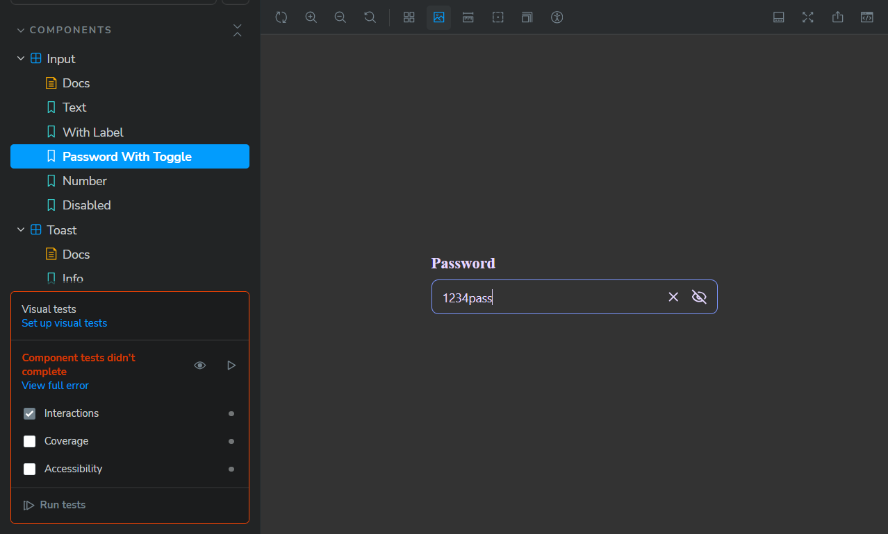
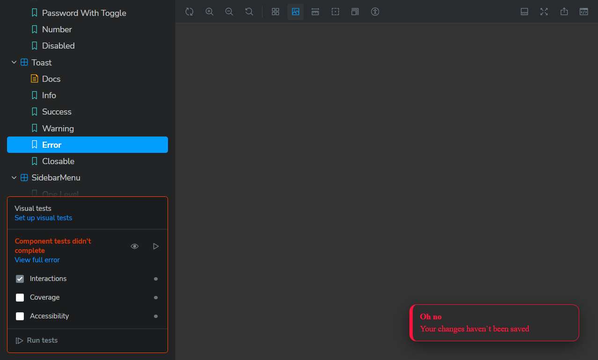
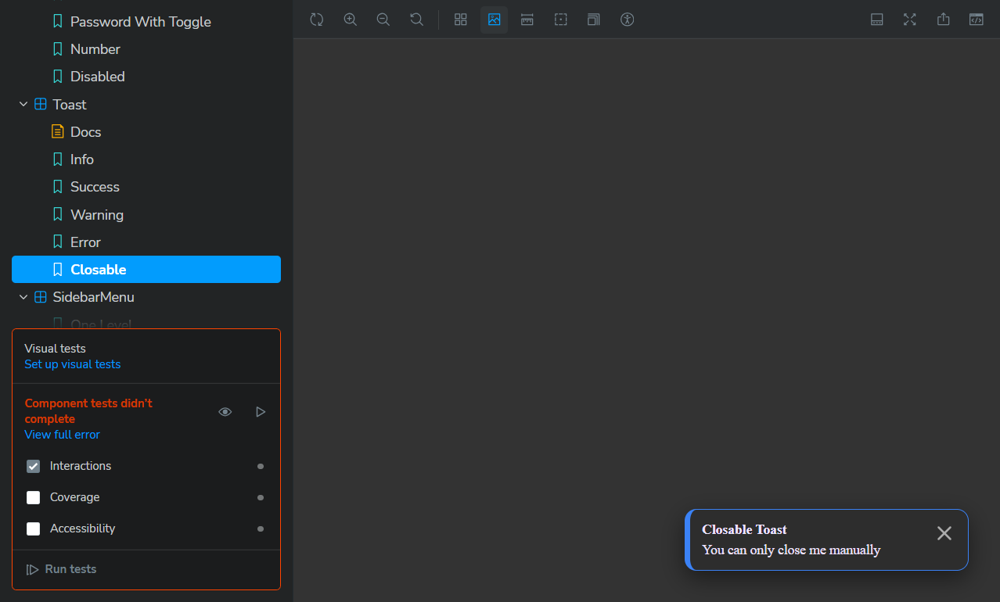
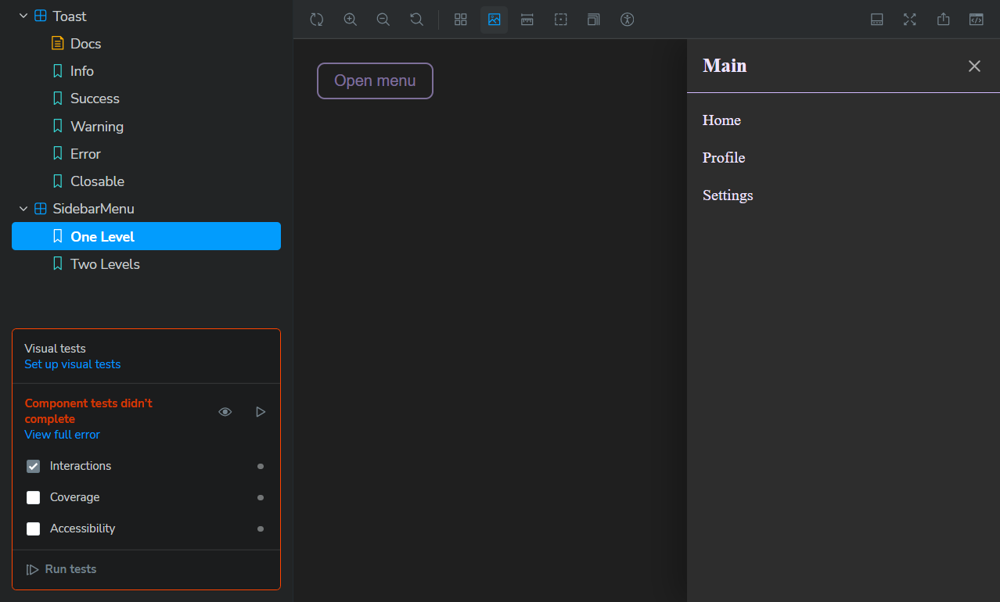
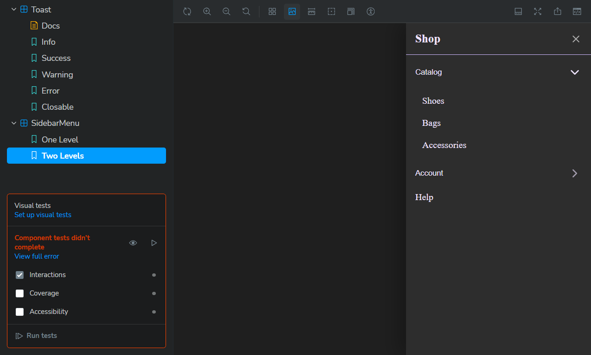

# 🎨 React Component Library with Storybook

This project is a small reusable **UI component library** built with **React**, **TypeScript**, and **Storybook**.

It demonstrates three reusable components:

1. **Input** – smart text field with password toggle and clearable option
2. **Toast** – animated notification message
3. **Sidebar Menu** – nested navigation panel with slide-in animation

---

## 🚀 Getting Started

### 1️⃣ Installation

```bash
# Clone the repository
git clone https://github.com/Roman1375/Storybook-Ui-Lib.git
cd storybook-ui-lib

# Install dependencies
npm install

# Run Storybook
npm run storybook
```

Storybook will open at [http://localhost:6006](http://localhost:6006).

---

## 🧩 Components Overview

### 📥 Input

Smart input field supporting:

- `type="text" | "password" | "number" | "email" | "search"`
- Password visibility toggle 👁️
- Optional clearable ✕ button
- Controlled or uncontrolled usage

**Storybook examples**

- `Сomponents/Input → Text`
- `Сomponents/Input → WithLabel`
- `Сomponents/Input → PasswordWithToggle`
- `Сomponents/Input → Number`
- `Сomponents/Input → Disabled`

**Screenshots:**





---

### 🔔 Toast

Animated notification displayed at the bottom-right corner.

**Features**

- Types: `info | success | warning | error`
- Auto-dismiss after configurable duration
- Optional close button
- Slide/Fade animation with **Framer Motion**

**Storybook examples**

- `Feedback/Toast → Info, Success, Warning, Error, Closable`

**Screenshots:**





---

### 📚 Sidebar Menu

Sliding menu with nested submenus and background overlay.

**Features**

- Slides in from the **right**
- Supports multiple nested levels
- Accordion-style expandable items
- Closes on background click

**Storybook examples**

- `Navigation/SidebarMenu → OneLevel, TwoLevels`

**Screenshots:**





---

## 🧠 Tech Stack

- ⚡ **Vite** (React + TypeScript)
- 🧩 **Storybook** (with `@storybook/react-vite`)
- 🎨 **CSS Modules**
- 💫 **Framer Motion** (animations)
- 🧹 **ESLint + Prettier**

---

## 📂 Folder Structure

```
src/
├── components/
│   ├── input/
│   ├── sidebar/
│   └── toast/
├── index.css
└── main.tsx
```
